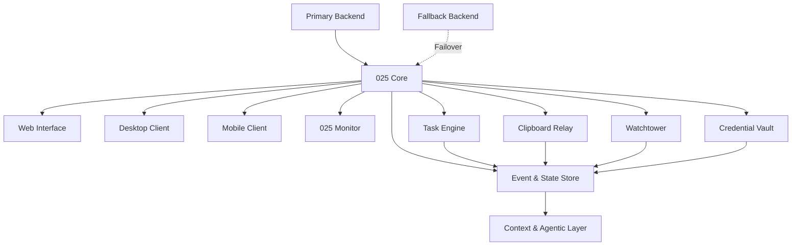

<p align="center">
  
</p>

<h1 align="center">025 Recursive Memory</h1>

<p align="center">
  <strong>One Mind. Every Interface.</strong>
</p>

<p align="center">
  <em>A persistent digital intelligence for a single operator.</em>
</p>

<p align="center">
  
  
  
  
</p>

---

## Overview

**025 Recursive Memory** is an actively developed personal digital ecosystem designed around a simple idea:

> **One persistent system should be able to follow its operator across devices and interfaces.**

025 provides a shared infrastructure layer for tasks, clipboard state, system awareness, credentials, and contextual automation. Rather than functioning as a conventional chatbot or isolated productivity application, 025 is being designed as a **persistent, event-driven system** that maintains state across connected interfaces.

The project currently focuses on building reliable synchronization and device infrastructure before expanding into more advanced **agentic and context-aware automation**.

### Core Interfaces

- **Web** — Primary dashboard and system interface
- **Desktop** — Persistent system client and device integration
- **Mobile** — Portable access to synchronized state and actions
- **Monitor** — A small dedicated embedded device for ambient system status

---

## Current Development Status

> ⚠️ **025 Recursive Memory is currently under active development.**

This repository serves as a **public technical overview and development reference**. Architecture, interfaces, APIs, and implementation details may change as the system evolves.

The initial development phase is centered around:

- Cross-device task synchronization
- Shared clipboard relay
- Device registration and authentication
- Real-time state synchronization
- System and project monitoring
- Persistent task and event state
- Primary/fallback backend architecture
- Embedded 025 Monitor prototype

The longer-term roadmap introduces contextual and agentic capabilities on top of this infrastructure.

---

# System Architecture

025 is designed as a distributed system rather than a collection of independent applications.



### Architectural Principles

#### Persistent State

025 maintains a centralized representation of synchronized operator state rather than treating each device as an isolated application.

#### Event-Driven Synchronization

Changes are propagated as events rather than requiring every interface to continuously poll the backend.

Example:

```text
TASK_CREATED
      ↓
025 Core
      ↓
Event Bus
      ↓
┌──────────┬──────────┬──────────┐
│ Desktop  │  Mobile  │ Monitor  │
└──────────┴──────────┴──────────┘
```

#### Interface Independence

Each interface is optimized for its environment while interacting with the same underlying 025 state.

```text
             025 CORE
                 │
     ┌───────────┼───────────┐
     │           │           │
    WEB       DESKTOP      MOBILE
                 │
              MONITOR
```

#### Fault Tolerance

025 is being designed around a **primary/fallback backend model** so temporary infrastructure failure does not necessarily result in loss of local state.

---

# Core Modules

## SYNC — Task Synchronization

025 provides a synchronized task and objective layer across connected devices.

Planned capabilities include:

- Cross-device task creation and updates
- Deadlines and reminders
- Task priorities
- Recurring objectives
- Focus sessions
- Completion state synchronization
- Local caching for temporary connectivity loss

Example:

```text
Phone
  │
  │ Create Task
  ▼
025 Core
  │
  ├── Desktop
  ├── Web
  └── Monitor
```

A task created on one interface becomes available across the connected ecosystem.

---

## CLIP — Clipboard Relay

025 provides a shared clipboard layer between trusted devices.

The desktop client can observe clipboard changes and relay selected content through the 025 Core.

Mobile devices can explicitly submit locally copied content to 025 when platform restrictions prevent unrestricted background clipboard access.

Example:

```text
Laptop
   │
   │ Relay
   ▼
025 Core
   │
   ├── Phone
   └── Desktop
```

Planned functionality:

- Cross-device clipboard
- Clipboard history
- Explicit relay from mobile
- Pinned clipboard entries
- Device-targeted relay
- Encrypted clipboard transport
- Automatic expiry for temporary entries

Sensitive clipboard content will be handled using explicit privacy controls rather than assuming every clipboard entry should be permanently stored.

---

## WATCH — Watchtower

Watchtower provides system awareness for projects and services connected to 025.

Rather than replacing dedicated monitoring infrastructure, Watchtower is intended to provide a **single operator-oriented overview** of the systems that matter.

Potential signals include:

- Service availability
- Uptime
- Health checks
- Deployment state
- Repository activity
- Local project state
- Connectivity
- Important system events

The long-term goal is to move beyond passive dashboards toward **contextual attention management**.

---

## VAULT — Credential & Secret Storage

Vault is intended to provide a centralized security layer for credentials and secrets used across trusted 025 interfaces.

Planned areas include:

- Encrypted credential storage
- Local key protection
- Secure synchronization
- Credential generation
- Device authorization
- Secret expiry and rotation
- Fine-grained access control

Security architecture will be developed independently from ordinary task and synchronization data.

> **Security-sensitive functionality will not be considered production-ready until its storage, encryption, key-management, and device-authentication model has been properly implemented and reviewed.**

---

# FOCUS — Contextual Attention

One of the longer-term goals of 025 is to make task management **context-aware rather than purely reminder-driven**.

For example, if an operator creates:

```text
OBJECTIVE
Network Programming Revision

PRIORITY
HIGH

FOCUS WINDOW
20:00 → 22:00
```

025 does not immediately block unrelated applications.

Instead, it can observe permitted high-level activity signals and determine whether the operator may have drifted away from the active objective.

For example:

```text
Focus Session: ACTIVE

Current Activity:
Instagram

Duration:
12 minutes

Priority Objective:
Network Programming

Recent Progress:
None

        ↓

Context Evaluation

        ↓

Possible Attention Drift
```

Rather than forcibly blocking the application, 025 can provide a proportional intervention:

> **You've been away from your priority objective for a while. Resume?**

The system is intended to **assist rather than control**.

### Design Principle

> **025 may advise. 025 may intervene. 025 does not decide.**

Future iterations may incorporate historical behavior, task context, timing, and local AI models to determine whether an intervention is actually useful.

---

# Agentic Direction

025 is intentionally **not being designed as another chatbot**.

The long-term objective is an agentic system capable of maintaining an ongoing model of:

```text
OBJECTIVES
    ↓
CURRENT STATE
    ↓
OBSERVED EVENTS
    ↓
CONTEXT
    ↓
DECISION
    ↓
INTERVENTION / ACTION
    ↓
MEMORY
    ↓
NEXT STATE
```

This creates a closed-loop system rather than a question-and-answer interface.

Potential future capabilities include:

- Context-aware task decomposition
- Objective tracking
- Adaptive reminders
- Attention-drift detection
- Event-driven automation
- Dependency awareness
- Historical context retrieval
- Local AI inference
- Autonomous scheduling
- Cross-device agent workflows

These capabilities are **planned rather than claimed as completed functionality**.

---

# 025 Monitor

The 025 Monitor is a planned miniature embedded interface designed to provide an ambient physical presence for the system.

The device is intentionally minimalist:

```text
┌──────────────────────┐
│                      │
│       025 LOGO       │
│                      │
│    ● CORE ONLINE     │
│                      │
│    TASKS       04    │
│    ALERTS      01    │
│                      │
│    UPTIME            │
│    04D 17H 32M       │
│                      │
└──────────────────────┘
```

The Monitor is intended to use a small full-color display so that the 025 visual identity can be preserved while allowing different system states to be represented.

### Example states

```text
NORMAL
025 Orange
    ↓
SYNCING
Amber / animated indicator
    ↓
ATTENTION
Highlighted notification
    ↓
CRITICAL
Error state
    ↓
IDLE
025 Logo
```

The device is intended to function as an **ambient status interface**, not as a miniature smartphone.

---

# Synchronization Model

025 uses an event-oriented synchronization model.

A simplified example:

```text
DEVICE A
   │
   │ TASK_UPDATED
   ▼
025 CORE
   │
   ├── Persist Event
   │
   ├── Update State
   │
   └── Broadcast Event
          │
          ├── DEVICE B
          ├── DEVICE C
          └── 025 MONITOR
```

When a device temporarily loses connectivity, local state can be retained until the connection is restored.

```text
Last Event: #1842

Connection Lost
      ↓
Local State
      ↓
Connection Restored
      ↓
Request Events #1843+
      ↓
Reconcile
      ↓
Synchronized
```

This approach allows 025 to move toward reliable **offline-aware synchronization and eventual consistency** rather than relying exclusively on a continuously available connection.

---

# Primary / Fallback Architecture

025 is intended to support a primary backend and an auxiliary fallback backend.

```text
                 ┌─────────────────┐
                 │   025 CLIENT    │
                 └────────┬────────┘
                          │
                    Primary Core
                          │
                    ┌─────▼─────┐
                    │ AVAILABLE │
                    └───────────┘
                          │
                       Failure
                          │
                    ┌─────▼─────┐
                    │ FALLBACK  │
                    │   CORE    │
                    └───────────┘
```

The fallback system is intended to preserve essential ecosystem functionality rather than duplicate every capability of the primary system.

Potential fallback responsibilities include:

- Authentication
- Device discovery
- Task state
- Event synchronization
- Basic notifications
- Recovery and reconciliation

---

# Technology Direction

The exact technology stack is still being evaluated as implementation progresses.

Potential technologies include:

### Backend

- Python
- FastAPI
- REST APIs
- WebSockets
- PostgreSQL / SQLite
- Redis or equivalent event infrastructure
- Pydantic
- AsyncIO

### Frontend

- React
- TypeScript
- Vite
- Tailwind CSS
- Framer Motion

### Desktop

- Electron / Tauri or a lightweight native client
- OS clipboard integration
- Background synchronization
- Local state/cache

### Mobile

- Android
- Native platform integrations
- Local persistent state
- Background synchronization where supported by the platform

### Embedded

- ESP32 / ESP32-S3
- SPI TFT display
- Wi-Fi
- Bluetooth where required
- Lightweight embedded UI framework
- Li-Po battery
- Custom enclosure

### AI / Agentic Systems

- Local or self-hosted language models where appropriate
- Embedding-based retrieval
- Context/state retrieval
- Tool calling
- Event-driven automation
- Structured agent workflows

Technology choices may change during development.

---

# Repository Structure

The repository is organized around the ecosystem rather than a single application.

```text
025-recursive-memory/
│
├── assets/
│   └── 025RM.png
│
├── core/
│   ├── api/
│   ├── events/
│   ├── synchronization/
│   ├── authentication/
│   └── state/
│
├── web/
│   └── ...
│
├── desktop/
│   └── ...
│
├── mobile/
│   └── ...
│
├── monitor/
│   ├── firmware/
│   └── hardware/
│
├── docs/
│   ├── architecture/
│   ├── protocols/
│   └── roadmap/
│
└── README.md
```

> Directory structure will evolve as individual components are implemented.

---

# Engineering Focus

025 is being developed around several engineering areas:

- Distributed systems
- Event-driven architecture
- Real-time synchronization
- Cross-platform application development
- RESTful API design
- WebSocket communication
- Authentication and authorization
- Offline-first state management
- Fault tolerance and failover
- Secure credential storage
- Embedded systems
- Human-computer interaction
- Context-aware automation
- Agentic AI
- Local AI inference
- Persistent memory and state management

---

# Development Roadmap

## Phase 1 — Persistent Ecosystem

- [ ] Core backend
- [ ] Device registration and authentication
- [ ] Task synchronization
- [ ] Clipboard relay
- [ ] Watchtower foundation
- [ ] Primary/fallback backend
- [ ] Web interface
- [ ] Desktop client
- [ ] Mobile client
- [ ] 025 Monitor prototype

## Phase 2 — Context & Attention

- [ ] Focus sessions
- [ ] Context-aware reminders
- [ ] Attention-drift detection
- [ ] Adaptive intervention
- [ ] Historical behavioral context
- [ ] Objective progress tracking

## Phase 3 — Agentic Layer

- [ ] Context-aware planning
- [ ] Task decomposition
- [ ] Event-driven agents
- [ ] Local AI inference
- [ ] Autonomous workflows
- [ ] Cross-device agent coordination

> Roadmap items represent development direction and are not guarantees of future functionality.

---

# Privacy & Security

025 is designed as a **single-operator system**.

The public repository and portfolio interface are intended to expose the architecture and capabilities of the project without exposing private operator data.

Private information such as:

- Personal tasks
- Clipboard contents
- Credentials
- Private project state
- Device identifiers
- Authentication secrets
- API keys

will remain isolated from the public demonstration environment.

Security-sensitive components will be developed with explicit consideration for:

- Encryption at rest
- Encryption in transit
- Authentication
- Authorization
- Device trust
- Key management
- Data minimization
- Local storage security
- Secret handling

---

# Why 025?

Most productivity tools treat tasks, devices, files, notifications, and automation as separate applications.

025 explores a different model:

> **A persistent system that maintains context while the interfaces around it change.**

The objective is not to build another chatbot.

It is to build the infrastructure that allows an intelligent system to **remember state, observe events, synchronize across devices, and eventually act with context.**

---

# Project Status

**025 Recursive Memory is a work in progress.**

The architecture, implementation, hardware, and agentic capabilities are actively being developed. This repository is intended to document the project's evolution as individual components become functional.

More implementation details, technical documentation, benchmarks, and demonstrations will be added as development progresses.

---

<p align="center">
  <strong>025 RECURSIVE MEMORY</strong><br/>
  <em>One Mind. Every Interface.</em>
</p>
